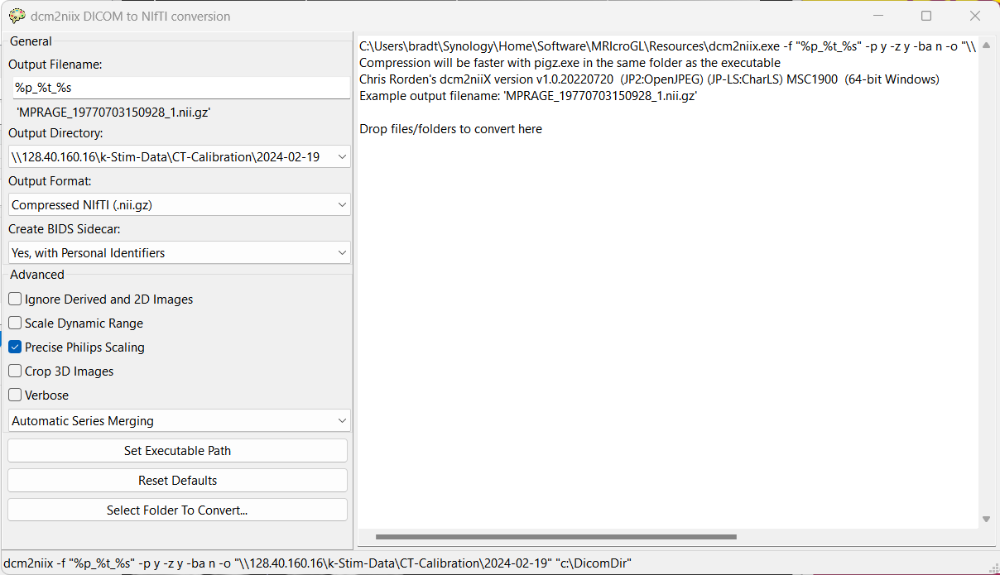

# Image conversion
## Converting DICOM images using MRIcroGL

The easiest way to convert the dicom images to nifti is to use [MRIcroGL](https://www.nitrc.org/projects/mricrogl). Install this, run it, and select `Import -> Convert DICOM to NIfTI` from the menu bar. Select the output folder to be the same as the root folder with the dicoms. Select to create the BIDS sidecar. This will generate a `.json` file with various scan parameters. Drag the root folder (containing sub-folders with DICOMs) into the window on the right.

## Converting DICOM images by script

An alternative way is to navigate to the folder with the dicom images, and call `convertDicoms.sh`. This will generate a sub-folder called `converted` which contains the nifti images. Conversion usually takes < 30 seconds.
