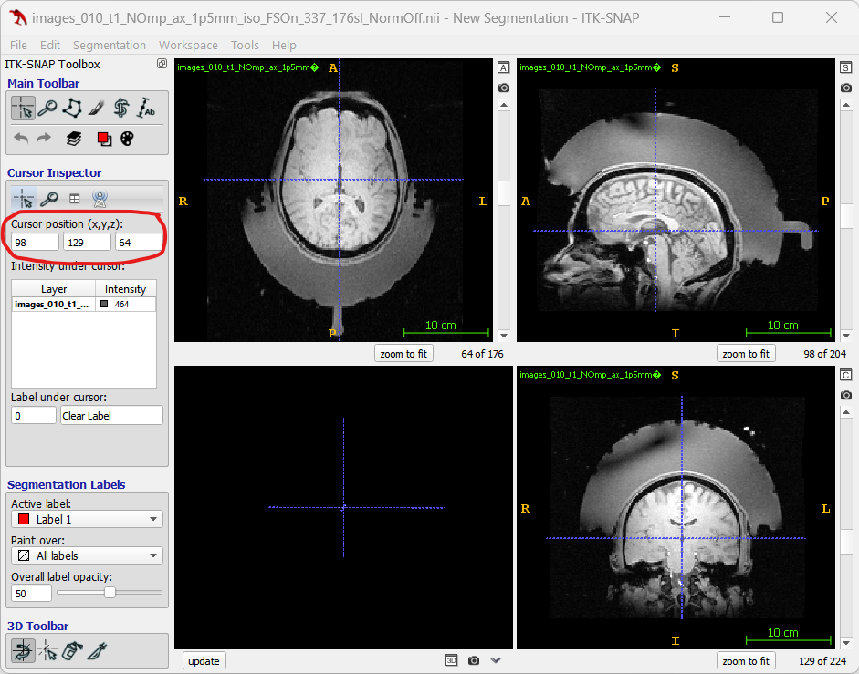
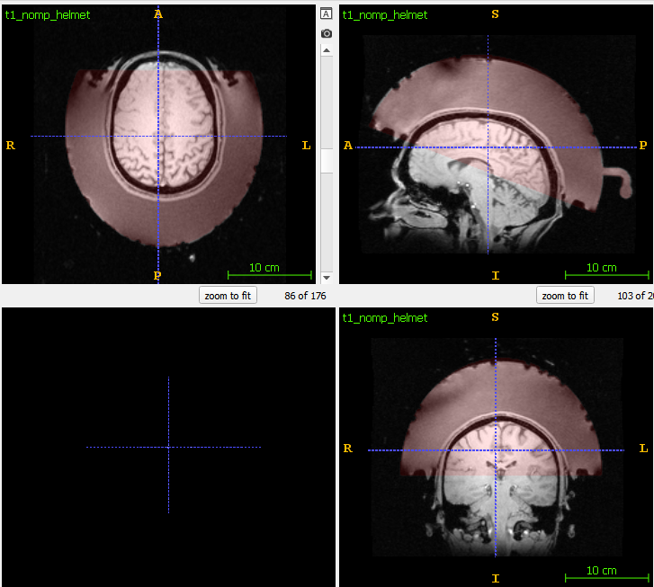
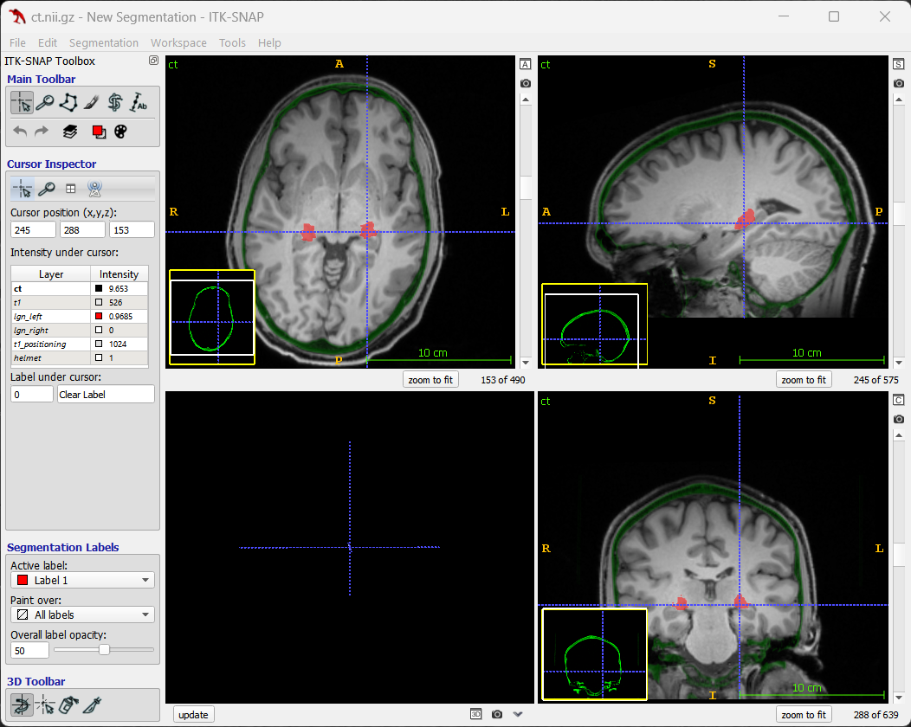
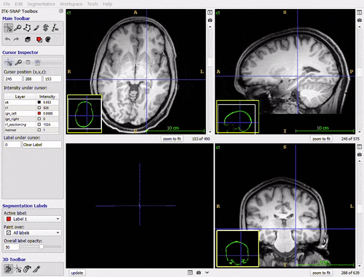

# Processing images for planning using k-Plan

## Overview

The CT and MR images from the planning and positioning session must first be processed before loading into k-Plan. There are four main steps:

1. Segmenting the thalamus
2. Defining the input images and parameters
3. Running the processing script
4. Verifying the processed images

## Segmenting the thalamus

To apply thalamus segmentation using the FreeSurfer module [ThalamicNuclei](https://freesurfer.net/fswiki/ThalamicNuclei), navigate to the planning image directory, and call the `segmentThalamus` bash script. The segmentation should be applied to the axial T1 planning image. If there are two identically named images, always chose the second one, as this is the one where distortion correction has been applied.

```bash
cd /mnt/k-Stim-Data/Subject-Data/S004/Images-Planning/F3T_2023_008_004/
```

```bash
segmentThalamus.sh images_09_t1_mpr_ax_1mm_iso_withNose_32ch_v2.nii
```

This creates a folder in the image directory with the same name as the image containing the posterior probabilities for the thalamic nuclei. 

## Defining the input images and parameters

Make a copy of `bash-scripts/processImagesForPlanningS00X` from this repository and place it in the `k-Stim-Data/Subject-Data/S00X/Images-kPlan` folder, renaming `S00X` to the appropriate subject number. Open the script, shown below, and set the required folder and filenames. The CT image should be the low-dose CT reconstructed with the `BONEPLUS` convolution kernel. This can be verified by opening the accompany `.json` file. The MR planning image should be the axial T1. If there are two identically named images, always chose the second one, as this is the one where distortion correction has been applied. The MR positioning image should be the one with no-magnetization pulse (`noMP`). For both images, open them in, e.g., ITKSnap, and find the approximate position of the center of the brain. Note, one of the inputs must be space separated, and the other comma separated. Finally, define the target positions in the native resolution T1 in 0-indexed voxel coordinates.

```shell
#!/bin/bash
# Script to process subject images.

# Subject ID
subject="S004"

# CT image filename
ct_filename="S004_10.10_Low_Dose_head_-_Trial_setup_MB_HHedit_30.03.23_20231108141700_301.nii.gz"

# MR planning images
mr_foldername_planning="F3T_2023_008_004"
t1_ax_filename="images_09_t1_mpr_ax_1mm_iso_withNose_32ch_v2.nii"
t1_ax_head_centre="117 129 97" # space separated
freesurfer_seg_folder="images_09_t1_mpr_ax_1mm_iso_withNose_32ch_v2_thalamus_segmentations"

# Target position in t1_ax image in FSL voxel coordinates (0-indexed)
left_lgn_target="96 114 94"
right_lgn_target="135 113 93"

# MR Positioning images
mr_foldername_positioning="F3T_2023_009_022"
t1_no_mp_filename="images_08_t1_NOmp_ax_1p5mm_iso_FSOn_337_176sl_NormOff.nii"
t1_no_mp_head_centre="100,112,75" # comma separated

# Script folders (only change these if the folders are in a different place)
matlab_folder="$HOME/Drive/Repos/k-stim-image-processing/matlab-scripts"
nifti_toolbox="$HOME/Drive/Repos/k-plan-qms-sem/libraries/nifti"
helmet_ref_file="$HOME/Drive/Repos/k-stim-image-processing/reference-images/helmet-registration-image-1mm.nii.gz"

# Run script
source processImagesForPlanning.sh
```

Finding the approximate brain center in ITKSnap



## Running the processing script

Make sure you have installed the required libraries and setup the various paths as explained in [setup](setup.md). Then login to one of the BUG servers, change directories to the `k-Stim-Data/Subject-Data/S00X/Images-kPlan` folder and then call:

```shell
./processImagesForPlanningS00X.sh
```

On Nyborg, the script will take about 20 minutes (longer on Nyborg, quicker on Helmholtz).

## Verifying the processed images

### Verifying the helmet registration

In `k-Stim-Data/Subject-Data/S00X/Images-kPlan/helmet-registration` 

- open `t1_nomp_helmet.nii` 
- overlay `t1_nomp_helmet_helmet_registered_to_brain`. 

Verify that the helmet reference image correctly overlays the bowl.



### Verifying the planning-positioning registrations

In `k-Stim-Data/Subject-Data/S00X/Images-kPlan`

- Open `ct.nii.gz`
- Overlay all other images in the same folder

First, verify:

- The CT-MR registration (toggle MR overlay on CT)

- The LGN is approximately the correct place
- Open the `target_position_left_lgn.txt` (and right) and verify that the `Target Position in CT Image (0-indexed voxels)` is within the LGN. If viewing in ITKSnap, add 1 to the x, y, z, voxel position to account for ITKSnap 1-indexing.

The image below shows the CT (coloured green), planning T1, and LGN segmentations (red) with the cross hair at the target position in the left LGN for S004.



Next, verify:

- The positioning-planning brain registration (toggle display of `t1_positioning` overlaid on `t1`). The positioning brain will have much less contrast (image taken without a magnetization pulse) but it should be easy enough to check the main features are in the correct place (see animation below).
- The positioning-helmet registration (toggle display of `helmet` on `t1_positioning` - this should have already been verified in the previous step). In this view, the helmet image and planning image will likely be a bit cropped, unless a very large padding value was used.



