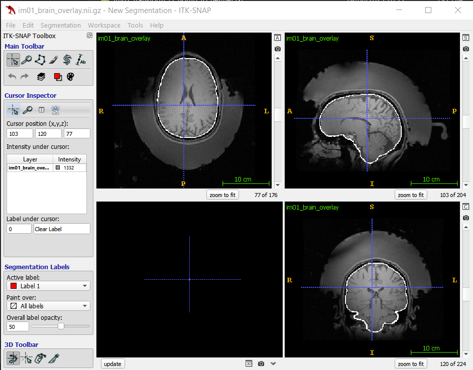
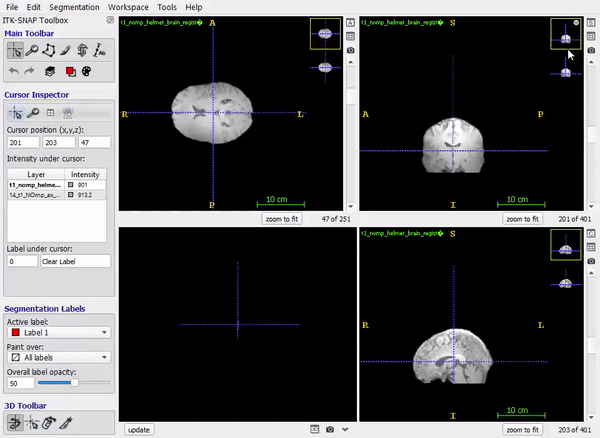
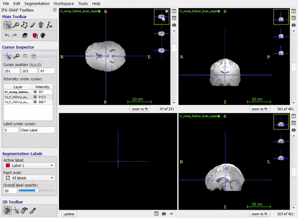

# Real-Time Replanning Protocol

This document outlines the steps required for real-time replanning between stimulation sessions, which compensates for small changes in participant position relative to the helmet.

## Overview

Between stimulation sessions, small shifts in participant position (typically 1-5 mm) can occur. To maintain precise targeting, we:

1. Acquire a new positioning MR image at the beginning of each session
2. Calculate the shift in target position using this new image
3. Apply geometric phase adjustments to the ultrasound transducer elements

This approach allows for quick adjustments without needing to re-run the full simulation, while maintaining targeting accuracy within ~0.2 mm.

## Process

### 1. Create a Subject-Specific Replanning Script

Create a replanning script for each subject based on the template below. Save it as `runReplanning<SubjectID>.sh` (e.g., `runReplanningS003.sh`).

```bash
#!/bin/bash

exec > >(tee -a replanning-log.txt) 2>&1

#############################
# USER DATA
#############################

echo " "
echo "============================================"
echo "Running replanning for SUBJECT NAME (S00X)"
echo "============================================"

# Define literals
head_center=" X,Y,Z"  # Head center coordinates from positioning image
reference_image="/mnt/k-Stim-Data/Subject-Data/S00X/Images-kPlan/helmet-registration/t1_nomp_helmet.nii"

# Target position - uncomment the target you want to use
# Left LGN target (in reference image coordinates)
# echo "Target selected: Left LGN"
# target_pos=" X Y Z"

# Right LGN target (in reference image coordinates)
echo "Target selected: Right LGN"
target_pos=" X Y Z"

# Off-target position (if applicable)
# echo "Target selected: Off Target"
# target_pos=" X Y Z" 

#############################

# Start timer
start=$(date +%s)

# Assume input image is in the current folder, and is the only .nii or .nii.gz file
input_image=$(ls *.nii* 2> /dev/null)

if [[ -z "$input_image" ]]; then
    echo "No .nii or .nii.gz file found in the current directory."
    exit 1
else
    echo "Processing file: $input_image"
fi

# Register new image with the helmet
registerWithHelmet.sh -i $input_image -c $head_center

# Compute target shift
computeTargetShift.sh $reference_image $input_image $target_pos

# Print run time
end=$(date +%s)
runtime=$((end-start))
echo "Real time processing completed in $runtime seconds."
```

### 2. Customize the Script

For each subject, update the script with:

- Subject ID and name
- Head center coordinates (from original positioning scan)
- Path to the reference image (original t1_nomp_helmet.nii)
- Target position coordinates
  - Choose either Left LGN, Right LGN, or Off-target as appropriate
  - These should be the coordinates from the original planning session

### 3. Run the Replanning Procedure

1. Convert the new positioning scan to NIfTI format

2. Move the NIfTI file to a working directory

3. Make the replanning script executable:

   ```bash
   chmod +x runReplanning<SubjectID>.sh
   ```

4. Run the script:

   ```bash
   ./runReplanning<SubjectID>.sh
   ```

### 4. Review the Results

1. When the brain extraction is complete, double click on `ZZZ_brain_overlay.nii.gz` and check the brain extraction has worked. The white overlay should roughly encircle the brain.

   

2. When the helmet registration is complete, drag `ZZZ_brain_registered_to_helmet.nii.gz` over the reference brain. Verify that it is in a broadly similar position. Some small movement is expected.

   

3. When the brain registration is complete, drag `ZZZ_brain_registered_with_reference.nii.gz` over the reference brain. Verify these have correctly registered. The contrast may appear slightly different, and the outline of the image might be different (because of the brain extraction) but the interior features shouldn't move.

   

## Notes

- The script creates a log file (`replanning-log.txt`) that records all operations
- The repositioning accuracy should be within 3 mm (maximum observed shift across participants)

## Troubleshooting

- If registration fails, check that the head center coordinates are correct
- Verify that the input image is in the correct format and orientation
- Ensure FSL and required tools are properly installed and in the PATH